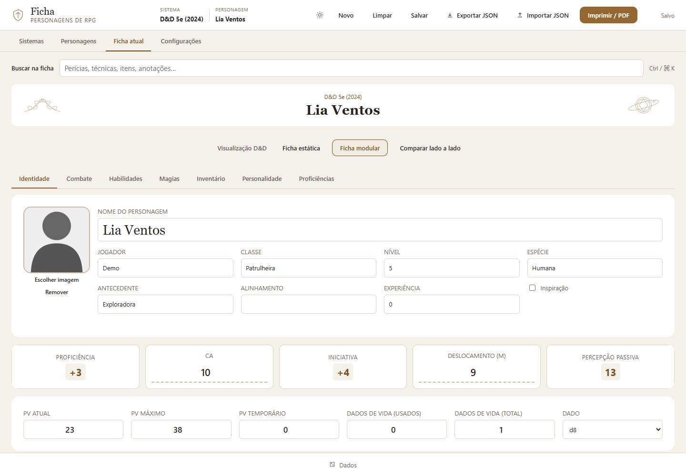
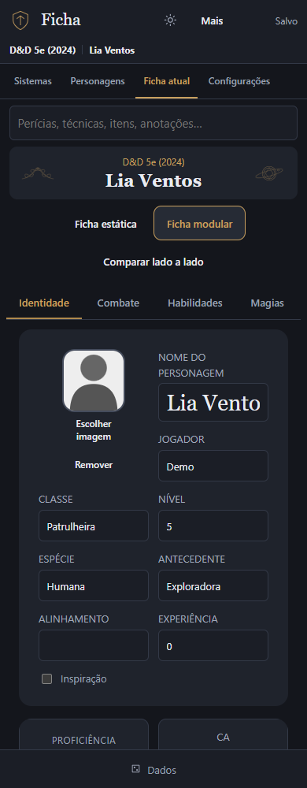
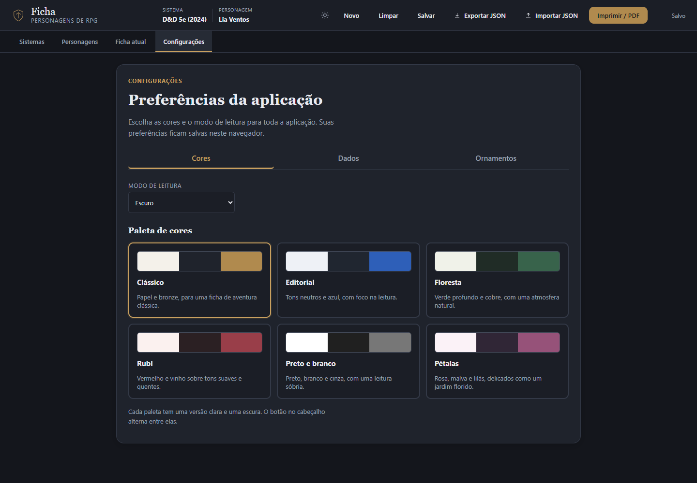
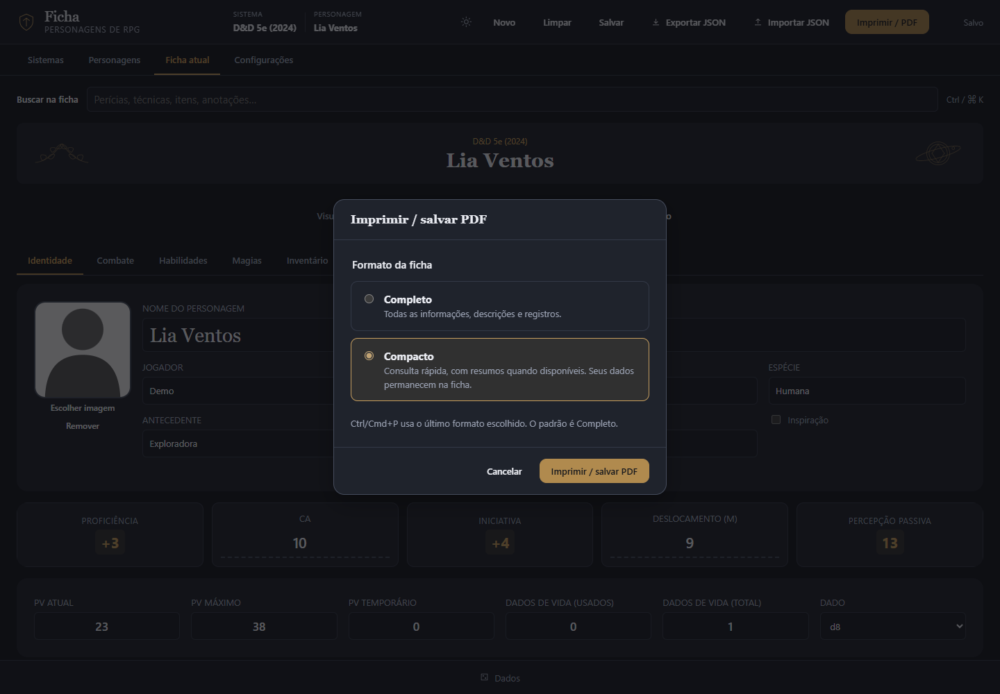

# Ficha RPG

**Fichas bonitas, organizadas e prontas para a sessão.**

Crie seus personagens, encontre o que precisa durante o jogo e leve a ficha para o papel. O Ficha RPG reúne organização, personalização e assistência às regras em uma interface feita para computador e celular.

Seu propósito é dar espaço a diferentes sistemas de RPG: desde uma ficha preenchível até uma ficha com cálculos e recursos assistidos. As escolhas e decisões da mesa continuam com você.



## Mais tempo jogando

- **Seus personagens em um só lugar.** Crie, duplique e organize fichas na biblioteca local. Importe e exporte personagens e pacotes de sistemas em JSON. Em Configurações, **Exportar tudo** salva a biblioteca e **Importar tudo** permite mesclar ou substituir com confirmação.
- **Encontre sem percorrer todas as abas.** A busca consulta a ficha inteira, mostra os valores atuais e leva você até o campo, com tolerância a erros de digitação.
- **Acompanhe os recursos da sessão.** Vida, inventário, habilidades, magias e rolagens ficam organizados conforme o sistema escolhido.
- **Assistência quando ela ajuda.** Cálculos, criação e evolução têm controles próprios nos sistemas compatíveis. Edição direta durante o jogo não cobra evolução automaticamente.
- **Consulte também no celular.** Abas, cartões e tabelas se reorganizam para telas menores; as ações do cabeçalho ficam no menu **Mais**.

## Uma ficha com a sua cara

Escolha entre seis paletas — Clássico, Editorial, Floresta, Rubi, Preto e branco e Pétalas — em modo claro ou escuro. Combine ornamentos, posições e intensidade, ou mantenha uma apresentação simples. Os dados podem aparecer em texto ou com ícones vetoriais acompanhados de texto.

<table>
  <tr>
    <td align="center"></td>
    <td align="center"></td>
  </tr>
  <tr><td align="center">Para consultar durante a sessão</td><td align="center">Cores e apresentação do seu jeito</td></tr>
</table>

## Do navegador para a mesa

Em **Imprimir / PDF**, escolha **Completo** para levar as informações detalhadas ou **Compacto** para uma versão de consulta com os resumos disponíveis no layout. No D&D compacto, por exemplo, magias ficam com nome e nível e moedas ocupam menos espaço.

O documento adapta a identidade visual da ficha ao papel A4 e inclui o conteúdo definido para o formato escolhido, mesmo que haja abas fechadas ou filtros ativos na tela. Salve como PDF pelo diálogo de impressão do navegador. O JSON continua sendo o arquivo para backup e reimportação.

<p align="center"></p>

## Sistemas disponíveis

| Sistema | O que oferece |
| --- | --- |
| D&D 5e (2024) | Ficha modular com atributos, perícias, recursos, magias, inventário e cálculos. Também oferece a ficha estática e a comparação lado a lado, com os mesmos dados. |
| RPG autoral em desenvolvimento | Ficha assistida com criação por pontos, evolução, técnicas, recursos, estados e Pool. Seu conteúdo tem direitos próprios, separados da engine. |
| Seus sistemas | Importação de pacotes com dados e layouts configuráveis. Componentes compatíveis podem ser reutilizados; mecânicas novas podem exigir implementação adicional. |

**O projeto está em desenvolvimento**, ainda sem lançamento de produção. A cobertura depende do sistema: não há automação integral de livros, editor visual completo ou ajuste manual universal de resultados calculados.

## Seus dados

A biblioteca e as preferências ficam no navegador, sem conta ou backend. Não há sincronização entre dispositivos ou backup em nuvem. **Use Exportar tudo regularmente**: limpar os dados do site ou trocar de navegador/endereço pode tornar a biblioteca anterior indisponível. O backup inclui personagens, sistemas importados e preferências; sistemas embutidos acompanham o app. Se uma gravação falhar, a ficha continua em memória e pode ser exportada. Os arquivos exportados podem conter nomes, notas, imagens e dados de recuperação; revise-os antes de compartilhar.

Novos retratos são reduzidos e comprimidos para ocupar menos espaço. Imagens externas importadas permanecem nos dados, mas não são carregadas automaticamente.

As imagens deste README são capturas reais da interface com dados fictícios, feitas em um contexto de navegador isolado.

## Experimentar localmente

Requisitos: Node.js 22 ou superior, npm e um navegador moderno.

```sh
npm ci
node tests/static-server.mjs
```

Abra [http://127.0.0.1:4173](http://127.0.0.1:4173). Encerre o servidor com `Ctrl+C`. Use HTTP: abrir `index.html` diretamente por `file://` não é o fluxo suportado.

O servidor é para desenvolvimento e serve o repositório inteiro. Não o exponha à internet nem hospede a pasta inteira: memória interna, referências e dados privados não devem integrar uma distribuição.

## Para quem desenvolve

HTML, CSS e JavaScript com módulos ES, sem framework de interface. A engine declarativa separa **sistema** (dados e regras), **layout** (apresentação) e **personagem** (valores e escolhas). Sistemas usam JSONs distintos de layout e configuração, reunidos em pacotes `rpg-system-package` na importação/exportação, com `schemaVersion`.

A implementação está em `js/engine/`, os repositórios em `js/repositories/` e os contratos em `js/validation/schemas.js`. Regras específicas permanecem em componentes próprios quando necessário. Não se promete representar qualquer livro só com JSON.

Os testes usam Playwright com Microsoft Edge instalado. Pare o servidor manual antes de executar:

```sh
npm run test:e2e
npm run check:docs
```

Não execute suítes concorrentes na porta 4173. Para usar Chromium, ajuste o `channel` em `playwright.config.js` e instale o navegador correspondente pelo Playwright. Capturas e traces de testes ficam em `test-results/`, sem versionamento. Os prints de apresentação podem ser regenerados com `node scripts/capture-readme.mjs`, que usa a porta 4175.

A documentação de trabalho, os planos e os relatórios ficam privados e não acompanham o clone. Este README apresenta o produto e os passos essenciais para executá-lo.

## Direitos de uso

O código original da aplicação e da engine tem [licença própria de uso não comercial com atribuição](LICENSE). Uso, modificações e compartilhamento gratuito não comercial são permitidos nos termos da licença; exploração comercial exige autorização escrita. Não é uma licença MIT ou Apache-2.0.

Conteúdos de RPG, artes, marcas e materiais de terceiros têm direitos separados. O projeto é independente e não oficial, sem afiliação à Wizards of the Coast. A licença do código não libera livros, traduções ou desenhos. Consulte os [avisos de terceiros](THIRD_PARTY_NOTICES.md) e o [registro de direitos das artes](assets/artwork/README.md).
